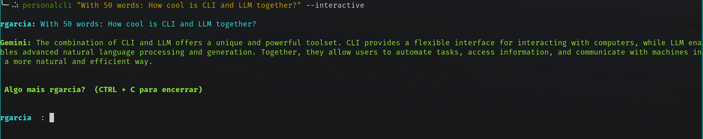

# General

This CLI query LLM models like gemini and return to user.


**Disclaimer:**


The creator of this package assumes no responsibility or liability for any usage of the package by users. Users are solely responsible for understanding the implications and potential risks associated with using the package. The intended purpose of the package is personal use. Misuse or unintended use of the package is at the user's own risk.


# License

[License](LICENSE)


# Install from git
```sh
pip install --user git+https://github.com/rafaelang/personal-cli.git;
export PERSONALCLI_GOOGLE_API_KEY=**************************
```


# Usage

```sh
personalcli "Question..."
```

```sh
personalcli "Question..." --interactive
```

# Install from download/clone

```sh
pip install --user [DOWNLOAD PACKAGE]/dist/personalcli-0.1.0-py3-none-any.whl
export PERSONALCLI_GOOGLE_API_KEY=**************************
```


